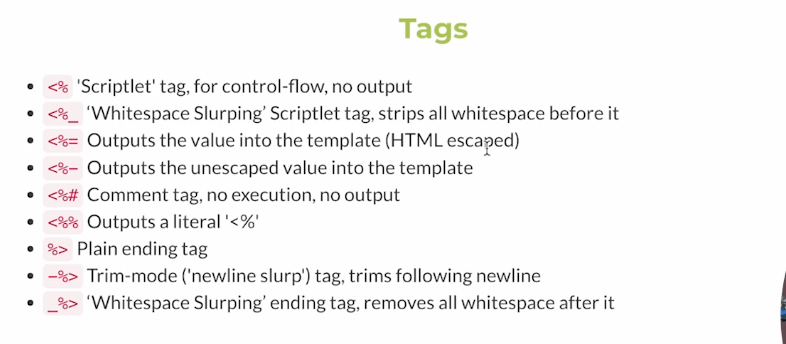

# EJS

## Templating

- EJS(Embedded Javascript Template)
- EJs is simple templating language that lets you generate HTML markup with plain JavaScript

## Using EJS

```js
app.set("view engine", "ejs");

app.get("/", (req, res) => {
  res.render("home.ejs");
});
```

## Views Directory

```js
const path = require("path");
app.set("views", path.join(__dirname, "/views"));
```

## Interpolation Syntax

- Interpolation refers to embedding expressions into marked up text.

## Tags



## Passing data into EJS

```js
//index.js
app.get("/rolldice", (req, res) => {
  let diceValue = Math.floor(Math.random() * 6) + 1;
  res.render("rolldice.ejs", { diceValue });
});
```

```js
//rolldice.js
  <body>
    <h1>Dice Value is: <%= diceValue %></h1>
  </body>
```

## Conditional Statements in EJS

Adding conditions inside EJS

```js
  <body>
    <h1>Dice Value is: <%= diceValue %></h1>
    <% if(diceValue==6){ %>
    <h2>Nice! Roll dice again</h2>
    <% } %>
  </body>
```

## Loops

```js
//index.js
app.get("/ig/:username", (req, res) => {
  let { username } = req.params;
  const followers = ["ABC", "JKL", "PQR", "XYZ"];
  // console.log(username);
  res.render("instagram.ejs", { username, followers });
});
```

```js
//instagram.js
    <h3>
      Followers List: <% for(user of followers){ %>
      <li><%=user%></li>
      <% } %>
    </h3>
```
